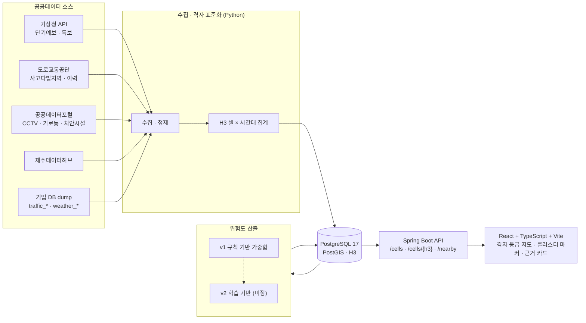

# 제주 안전지도 · 공공데이터 기반 위험도 산출 및 안전 분석 시각화

경북대학교 컴퓨터학부 **종합설계프로젝트1 (2026-2, 004분반)** · (주)제윤메디컬 산학협력 과제

> 여행객이 "지금 있는 곳이 얼마나 안전한지"를 **근거와 함께** 볼 수 있는 격자 기반 안전 분석 웹앱.
> 기업 서비스 위에 얹지 않고 팀이 별도 웹앱으로 개발하며, 검증된 부분은 기업이 이후 마이그레이션을 검토한다.


## 팀

| 역할 | 이름 |
|---|---|
| 팀장 · 기업/교수 소통 · 문서 | 김동우 |
| 팀원 | 이민환 · 서예은 · 안동균 · 배병윤 |
| 담당교수 | 권영우 교수 |
| 기업 멘토 | 이대규 책임연구원 (제윤메디컬 기술연구소 · 제주지사 제노바이츠) |

## 확정 상태 표기

- `[확정]` 멘토 QnA(9/17) 또는 수업 OT에서 명시된 사항
- `[검토 중]` 팀이 반영하려 하지만 아직 확보·검증되지 않은 사항
- `[미정]` 팀 협의 또는 멘토 확인 후 정할 사항

## 시스템 구성 (안)



## 기술 스택

| 구분 | 선택 | 근거 |
|---|---|---|
| 백엔드 | Java 21 · Spring Boot 3 · Spring Data JPA · Hibernate Spatial | 팀 역량 기준 선택 `[검토 중]` |
| 프론트 | React 19 · TypeScript · Vite · TanStack Query · Tailwind CSS | 기업 스택(React/Vite) + 현행 웹앱 관행 |
| 지도 | Kakao Maps SDK (일 10만 건 무료) · 격자 레이어 렌더러 `[미정]` | 기업 사용 중 |
| DB | PostgreSQL 17 · PostGIS · H3 | 기업 스택과 동일, dump 호환 `[확정]` |
| 파이프라인 | Python 3.12 · Pandas · scikit-learn · h3-py | 기업 스택과 동일 |
| 인프라 | Docker Compose · GitHub Actions | 로컬 개발 → 기업 서버 테스트 `[확정]` |

## 마일스톤

| # | 마일스톤 | 기한 | 학교 일정 |
|---|---|---|---|
| M1 | 계획 및 요구분석 | 9/28 | 9/21 계획발표 · 9/28 계획서 |
| M2 | 데이터 확보 검증 | 10/2 | — |
| M3 | 시각화 초안 · 위험도 v1 | 10/16 | 멘토 요청: 10월 중순 초안 |
| M4 | 중간발표 · 중간보고서 | 11/2 | 10/19 중간발표 · 11/2 보고서 |
| M5 | 고도화 · 논문 투고 | 11/20 | — |
| M6 | 통합 · 배포 · 결과발표 | 12/7 | 12/7 결과발표 |
| M7 | 결과보고서 · 실적 제출 | 12/20 | 12/20 제출 |

진행 상황은 [Milestones](../../milestones) 와 [Issues](../../issues) 에서 관리한다.

## 기업 소통 이력

| 일자 | 내용 |
|---|---|
| 9/9 | 팀장 → 멘토 인사 메일 (팀 구성, 과제 이해, 질문 5개) · 당일 멘토 서면 답변 |
| 9/16 | 카카오톡 단체방 개설(팀원 5 + 멘토) · 사전 질문지 6개 항목 공유 · 9/17 Zoom 확정 |
| 9/17 | 1차 온라인 미팅: QnA 문서 답변, 기업 사업소개·시연 영상 공유 · DB dump 요청 및 수령 |
| 9/18 | dump 링크 재수령 · 팀 내 공유 |

회의록: [docs/meetings](docs/meetings) · 데이터 출처 검증표: [docs/data/sources.md](docs/data/sources.md)

## 저장소 구조 (예정)

```
backend/    Spring Boot API
frontend/   React + TypeScript + Vite
pipeline/   Python 수집 · 격자 집계 · 위험도 산출
docs/       회의록 · 데이터 명세 · 보고서
```
